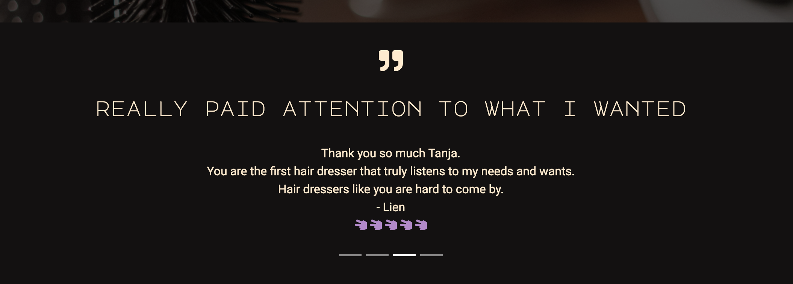

<div align="center"> 

# Bobs & Bangs

[Bobs & Bangs](https://potterjane.github.io/bobs-and-bangs/) is a (fictional) hair salon/barbershop, located in Stockholm and owned by a couple called Tilda and Mathias. 
With its blended mixture of masculine and feminine styles, it is a place where people from all walks of life are welcome to, for instance, get a haircut, 
styling or why not a facial? 
<br>
From this brochure website, you can find images/videos that gives you a peek inside the hair salon/barbershop, read customer reviews, check out the price list of all the services they offer, 
their contact information, and you can book an appointment.
<br>

Check out the Bobs & Bangs website [here](https://potterjane.github.io/bobs-and-bangs/)!

</div>

## Table of Contents
1. [**UX**](#ux)
    - [**Project Goals**](#project-goals)
        - [**User Goals**](#user-goals)
        - [**User Stories**](#user-stories)
        - [**Developer and Business Goals**](#developer-and-business-goals)
    - [**Design Choices**](#design-choices)
    - [**Wireframes**](#wireframes)

2. [**Features**](#features)
    - [**Existing Features**](#existing-features)

3. [**Technologies used**](#technologies-used)

4. [**Testing**](#testing)

5. [**Deployment**](#deployment)
    - [**How to run this project locally using a command line**](#how-to-run-this-project-locally-using-a-command-line)

6. [**Credits**](#credits)
    - [**Content**](#content)
    - [**Media**](#media)
    - [**Code**](#code)
    - [**Acknowledgements**](#acknowledgements)

7. [**Disclaimer**](#disclaimer)

## UX

### Project Goals

The primary goal of the Bobs & Bangs website is to provide information about the company, what services they offer and how they can book appointment or contact the company.
The design of the website should also reflect the style of the hair salon: a blended mixture of feminine and masculine features.
<br>
Features include images and videos of the hair salon and the two owners, Tilda (hair stylist) and Mathias (barber and skin care professional), modal button on the front page and a booking page 
to easily book appointments, reviews from customers, social links to provide an alternative way to learn more about the company and to get more 'peer reviews', and a contact page with numerous ways to
contact the company.
<br>
Bobs & Bangs has three target audiences: New customers, retained customers and potential new employees (hair stylist, barbers or skin care professionals).

#### User Goals

New and retained customer's goals are:
- A website that is not drowning in too much text and images
- Clear and concise price list of the services the company offers
- A page where they can read more about who is behind the company and what they value
- To know what other customers thought about the company's services, directly on the Home page
- Images and videos that gives them an insight on what it is like inside the hair salon/barbershop
- A quick and easy way to book appointments
- Get access to the company's openings hours so they can know which days they are available
- Easy access to different communication channels to contact the company, including social links
- Address and map that shows where the hair salon/barbershop is located

Potential new employee's goals are:
- A page where they can read more about who is behind the company and what they value
- Easy access to contact information for job seekers to send in their resume/CV
- Get a sense of what customers think of their services and if it lives up to the company's values
- A contact page or section with different communication channels to contact the company
- Address and map that shows where the hair salon/barbershop is located
- Get access to the company's opening hours to get an insight of what the working hours could be

#### User Stories

As a new or retained customer, I want:
1. To be able to know the background of the company, their price list of services, what other customers think of their services via reviews or social links, 
so that I can come to a decision whether or not to try out their services. 
2. To be able to easily book an appointment with as few clicks as possible, so that I can book an appointment with a minimum amount of time, anytime I like.
3. To know if there are any special offers/discounts directly on the first page, so that I know straight away if I should book an appointment now or later.
4. To be able to contact the company in various ways, depending on my personal preference, so that I can contact the company if I have any questions or want to book/rebook/cancel an appointment.
5. To see several images/videos, so that I can gain a better insight on what it is like inside the hair salon/barbershop.

As a hair stylist/barber looking for a job, I want:
1. To be able to know the background of the company, what customers think of their services via reviews or social links, so that I can come to a decision on whether or not
to send in my resume/CV.
2. To be able to contact the company in various ways, depending on my personal preference, so that I can contact the company if I have any more questions.

#### Developer and Business Goals

- A well-thought-out and professional design of the website that attracts new and retained customers and also potential new employees.
- A fun, creative and stylish project that reflects the developer's use of HTML and CSS, with a hint of Javascript.

### Design Choices

The overall feel of the website should be one that attracts people from all walks of life, with a blended mixture of feminine and masculine characteristics.

**Structure**

- The header is always fixed on the top of the pages of the website, containing the company logo on the left-hand side and the navigation bar on the right-hand side.
- The footer is always located at the bottom of the pages on the website, containing the company's contact information (visiting address, phone number and e-mail address), opening hours, 
social links to Facebook, Instagram, Youtube and LinkedIn. It also contains the developer's disclaimer and LinkedIn page.
- All of the pages can only be scrolled vertically and not scroll horizontally.
- From left to right, the navigation bar is in the order of importance: Home page, About page, Services page, Contact page and Booking page:
    1. The Home page is the first page that the user lands on when they enter the website. This page acts like an introductory page for user and it should be obvious within seconds on what kind of
    website this is. This developer used a hero section on this page, where they placed the background image, company title and slogan, a modal button and highlighted text about special offers
    to entice the user to book an appointment now. When user scrolls down further, they will also find a customer review carousel so that the users can get feedback from other 
    customers who have used the company's services. Both the hero and the customer review section is aligned at the center of the page. On tablet and mobile screens, the background image is 
    removed in order to create less clutter on the page.
    2. The About page is the second page on the navigation bar. Users click here when they want to read more about who is behind the company and what their values are. Users will also find an 
    image carousel that gives them an insight on how it looks inside the hair salon/barbershop. On larger desktop screens, the image carousel is floating on the right, next to the paragraphs. 
    On smaller desktop screens or on larger tablet screens, the paragraphs wrap around the image carousel. On mobile screens, the image carousel is placed under the paragraphs.
    3. The Services page is the third page on the navigation bar. Users click here when they want to know what services the company offers and to what price. These are listed in a table.
    They can also find videos with controls but muted and on loop. The videos show the faces behind the people who perform the services. On desktop and tablet screens, the videos are floating 
    on the right, next to the tables. On mobile screens, the videos are placed right under each table, respectively.
    4. The Contact page is the fourth page on the navigation bar. Users click here when they want to see all the numerous communication channels that the company offers. 
    The following is structured on desktop and tablet screens: On the top-left, they find the e-mail address for job seekers. On the top-right, they find information om what to do when they 
    want to rebook/cancel an appointment. Under that, they find a contact form as an alternative option to contact the company and right under that, they find an embedded Google map that 
    shows the location of the hair salon/barbershop. On mobile screens, each of these parts are vertically aligned.
    5. The Booking page is the fifth and last page on the navigation bar. Users click here when they want to book an appointment. This is an alternative way to book other than via the modal button 
    on the Home page. It is the exact same form as the one on the Home page with 7 input fields and one Submit-button. The structure of this form is consistent on all screen sizes.

**Backgrounds**

- The dark charcoal background colour that covers all pages of the website was chosen to represent the masculine characteristics of the hair salon but also to make the other elements on the page 
stand out more.
- The background image for the hero section on the Home page was chosen to reflect the rustic aesthetic of the hair salon. The image of the brush, scissors and razors on the wooden table
complements the text in the hero section, "Bobs", "Bangs" and "cut".

**Fonts**

- The primary font called **Major Mono Display** initially attracted the developer because of the monospace makes the text for the heading elements clear and readable in any size. 
It was the design of the uppercase typeface that made this font the ultimate choice because it gives room for colour to be added in a stylish way.
- The secondary font called **Roboto** was chosen because it was one of the popular pairings according to [Google Fonts](https://fonts.google.com/specimen/Major+Mono+Display) but also 
because the compact design complements the primary font.

**Colours**

- The two primary colours of light purple (#b288ca) and darker shade of white ('blanchedalmond') were chosen for the company logo, company title, icons, form borders, heading elements 
and most of the paragraph elements because the light purple colour represents the feminine feeling of the hair salon and the darker shade of white contrast the purple colour well.
- The standard black colour for the text and the light brown ('burlywood') background colour were used for the mark element, which is considered not a permanent element of the website. 
This element is used to inform the user's that the company currently has a discount offer and the colours make the element stand out from the rest of the website. 
It also makes the user's focus drawn straight to the discount offer.
- To meet the accessibility guideline's contrast ratio, a darker purple colour (#24152c) is used for the button's background colour to contrast the white ('white') foreground text colour. 
When the button is hovered, the colours switches places, i.e. the white ('white') colour is used for the button's background colour to contract the darker purple colour (#24152c) foreground 
text colour.

**Icons**

- Icons were used for the social links in the footer element and for the customer reviews in the Home page. They were chosen because they are universally understood and because
their obvious meaning and purpose removes the need for descriptive text.

**Images**

- The images were chosen for the About page to give the users an insight on what it is like inside the hair salon.
- Images were also chosen for mobile screens on the Services page to show the faces behind the people who perform the services. 
These images complement the tables that lists all of the services that is offered to all customers. 

**Videos**

- The videos were chosen for tablet and desktop screens on the Services page to show the faces behind the people who perform the services. The videos also show the owners interacting with their 
customer. These videos complement the tables that lists all of the services that is offered to all customers. 

### Wireframes

These wireframes were created using [Balsamiq](https://balsamiq.com/). The first version of the mobile and desktop mockups was made during the design and planning process for this project. 
The second version of the mobile and desktop mockup was made when the project was almost at the point of completion.

- [First version](https://github.com/potterjane/bobs-and-bangs/blob/29beb82abe6f7bced87dd899abb743d32003d710/wireframes/bb-wireframes-version-1.pdf)
- [Second and final version](https://github.com/potterjane/bobs-and-bangs/blob/f1370748e2ef25d35dbc62a0b01a8b6aca7fa1b8/wireframes/bb-wireframes-version-2.pdf)
 
### Existing Features

1. **Booking modal**
    - This Bootstrap modal can be found on the Home page. The modal opens only when the user clicks on the "Book Now" button in the hero section.
    - This feature gives users the option to book their appointment immediately from the Home page instead of the Booking page by having them filling out a form.
    - The users can also choose to close the modal by clicking on the modal “backdrop”.

<div align="center"><h4>Booking modal on Home page</h4>

</div>

2. **Review and image carousel**
    - Bootstrap's carousels were used in two places, one for the customer reviews in the Home page and on for the images in the About page. 
    - It gives the website a sense of movement and removes the hassle of scrolling through several images and reviews, manually.
    - This feature allows users to control the transition duration by holding down on the review/image. 

<div align="center"><h4>Customer review carousel on Home page</h4>

</div>

<div align="center"><h4>Image carousel on About page</h4>

</div>

3. **Navigation bar for desktop and mobile**
    - Standard navigation bar is used for desktop screens, aligned on the top-right side of all the pages.
    - Bootstrap's 'hamburger' navbar is used to collapse the navigation content for mobile and tablet screens. This is to remove any unneccesarry clutter for the users.
    - This feature allows users to easily navigate through each part of the website with minumum number of clicks.

<div align="center"><h4>Desktop navbar</h4>

</div>

<div align="center"><h4>Mobile and tablet navbar</h4>

</div>

4. **Links in the footer**
    - Target blank links to all the external social websites and contact information is found here.
    - This feature allows users to contact the company or to find more about the company with just one click, no matter which page the users are currently on.

<div align="center"><h4>Desktop footer</h4>

</div>

## Technologies Used

**This project used:**
- HTML and CSS programming languages. 
- [Bootstrap](https://getbootstrap.com/docs/5.0/getting-started/introduction/)'s CSS and Javascript library, version 5.0.
- [Google Fonts](https://fonts.google.com/) to style the website's fonts.
- [Font Awesome](https://fontawesome.com/)'s free kit of icons.
- [Pexels](https://www.pexels.com/) for free stock photos & videos.
- [GitHub](https://github.com/) to store and share all project codes.
- [GitPod](https://www.gitpod.io/) for their IDE (integrated development environment) while building the website.

## Testing 

This information can be found in separate [testing.md](testing.md) file

## Deployment

This project was created and developed using the [GitPod IDE](https://www.gitpod.io/), and then added, committed and pushed to [GitHub](https://github.com/) to store and share all project codes.

The followings steps were taken by the developer in order to deploy Bobs & Bangs to GitHub Pages:
1. Log into GitHub
2. Choose from the list the repositories, [bobs-and-bangs](https://github.com/potterjane/bobs-and-bangs)
3. Select 'Settings' from this repository's menu bar.
4. Scroll down to the 'GitHub Pages' section.
5. Under 'Source' and from the drop-down menu labelled 'None', select the 'master' branch and then click 'Save'.
6. When the page is refreshed, scroll back down to the 'GitHub Pages' section to retrieve the link to the [deployed website](https://potterjane.github.io/bobs-and-bangs/). 

### How to run this project locally using a command line

The project can be run locally by cloning the repository from GitHub. Below are the steps that the developer took to clone this project using HTTPS and the command line. 
Read this [GitHub document](https://docs.github.com/en/github/creating-cloning-and-archiving-repositories/cloning-a-repository) to find other ways to run this project locally.

1. Log into GitHub
2. Choose from the list the repositories, [bobs-and-bangs](https://github.com/potterjane/bobs-and-bangs)
3. From the drop-down menu labelled 'Code', select the HTTPS section and then click on the icon to copy the URL of the repository.
4. Open the local terminal.
5. Change the current working directory to the location where the cloned directory is to be stored.
6. When directory has been changed and location is selected, type ```git clone``` and then paste the URL of the repository that was copied in step 3.
```console
git clone https://github.com/potterjane/bobs-and-bangs.git
```
7. Press 'Enter'.

## Credits

### Content

- All text in this project was written by the developer.

### Media

#### Images
- The images were sourced from user [cottonbro](https://www.pexels.com/@cottonbro)'s [Pexels](https://www.pexels.com/) free library.

#### Videos
- The videos were sourced from user [cottonbro](https://www.pexels.com/@cottonbro)'s [Pexels](https://www.pexels.com/) free library.

### Code
- Bootstrap's [grid system](https://getbootstrap.com/docs/5.0/layout/grid/), [containers](https://getbootstrap.com/docs/5.0/layout/containers/), 
[custom button styles](https://getbootstrap.com/docs/5.0/components/buttons/), [tables](https://getbootstrap.com/docs/5.0/content/tables/) 
and [forms](https://getbootstrap.com/docs/5.0/forms/overview/) were used.
- 'Hamburger' or collapsed navbar was taken from [Bootstrap](https://getbootstrap.com/docs/5.0/components/navbar/).
- The carousel for the images and the customer reviews was taken from [Bootstrap](https://getbootstrap.com/docs/5.0/components/carousel/).
- Modal code taken from [Bootstrap](https://getbootstrap.com/docs/5.0/components/modal/).
- Code for date control was taken from this [W3Schools](https://www.w3schools.com/tags/att_input_type_date.asp) post.
- Code on how to make the textarea act responsive was taken from this 
[StackOverflow](https://stackoverflow.com/questions/39068128/how-can-i-make-a-textarea-that-fits-within-the-width-of-the-current-viewport/39068155) post.
- Code on how to wrap text around an image is taken from this [GeeksforGeeks](https://www.geeksforgeeks.org/how-to-wrap-the-text-around-an-image-using-html-and-css/) post.
- Code on how to embedd Google Maps was found in one of Code Institute's HTML module about [iframe](https://learn.codeinstitute.net/courses/course-v1:CodeInstitute+HE101+2020/courseware/fcc67a894619420399970ae84fc4802f/13db720675f94dbca6b0fe79467628ca/).
- Code on how to disable the horizontal scroll on all pages was taken from this [StackOverflow](https://stackoverflow.com/questions/17756649/disable-the-horizontal-scroll) post.
- Code on how to center an image was taken from this[W3Schools](https://www.w3schools.com/howto/howto_css_image_center.asp) post.
- Code on how to change the autofill styles for the input fields in forms was taken from this [CSS-Tricks](https://css-tricks.com/snippets/css/change-autocomplete-styles-webkit-browsers/) post.
- Code on how to hide spinners/arrows from input 'number' was taken from this [W3Schools](https://www.w3schools.com/howto/howto_css_hide_arrow_number.asp) post.
- Code to make sure the background image on the Hero section is covered on all browsers was taken from [CSS-Tricks](https://css-tricks.com/perfect-full-page-background-image/) post.

### Acknowledgements

Special thanks to: 
- Code Institute Mentor Mo for his time and for always offering his support and suggestions on what this developer needs to focus on in order to complete the project.
- Boyfriend Fredrik, friends Alex and Emelie and sisters Marie and Erin for testing the website and giving this developer positive and constructive feedback.

#### Disclaimer
The content of this website, including the images and videos used, are for educational purposes only.