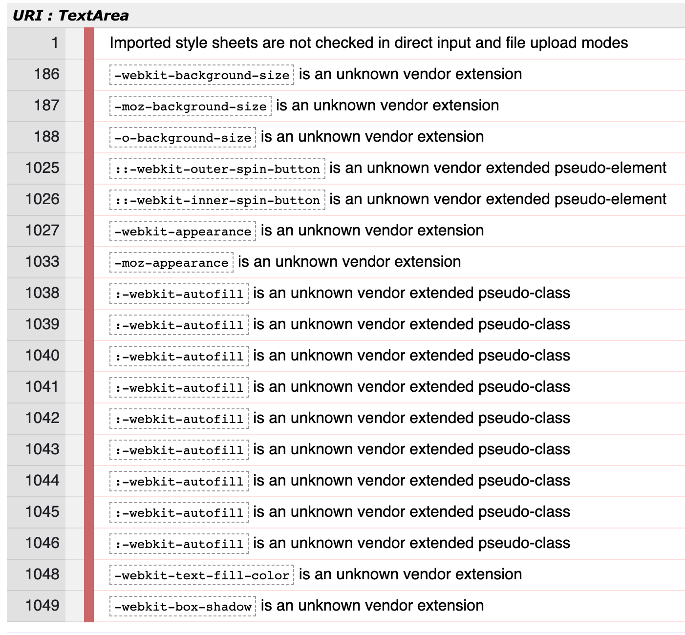
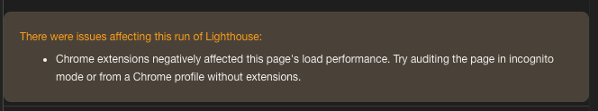
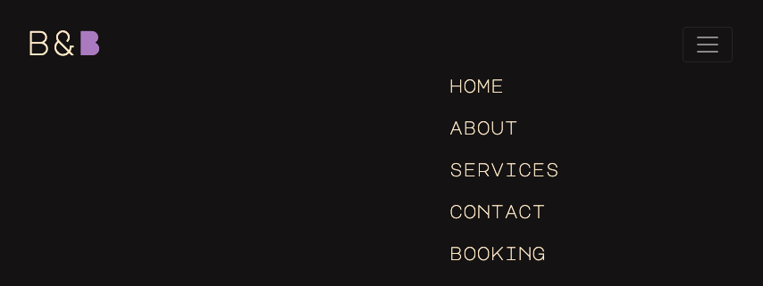

# Bobs & Bangs - Testing details

[Main README.md file](README.md)

[View website in GitHub Pages](https://potterjane.github.io/bobs-and-bangs/)

## Table of Contents

1. [**Automated Testing**](#automated-testing)
    - [**Validation services**](#validation-services)
    - [**Accessibility services**](#accessibilty-services)
    - [**Other Evaluation services via Lighthouse**](#other-evaluation-services-via-lighthouse)
2. [**User Stories Testing**](#user-stories-testing)
3. [**Manual Testing**](#manual-testing)
    - [**Testing on desktop screens**](#testing-on-desktop-screens)
    - [**Testing on tablet and phone screens**](#testing-on-tablet-and-phone-screens)
4. [**Bugs discovered**](#bugs-discovered)
    - [**Solved bugs**](#solved-bugs)
    - [**Unsolved bugs**](#unsolved-bugs)
5. [**Further Testing**](#further-testing)

## Automated Testing

### Validation services
- [W3C Markup Validation]( https://validator.w3.org/) was used to validate all the HTML pages (home, about, services, contact, booking).
Copied all the code from the html page, pasted it in the field under 'Validate by direct input' and then clicked on the 'Check' button.
**No errors or warnings to show on any of the HTML pages.**
- [W3C CSS validation](https://jigsaw.w3.org/css-validator/) was used to validate CSS. Copied all the code from the css page, pasted 
it in the field under 'By direct input' and then clicked on the 'Check' button.
**No errors were found, however there were some warnings.** 
This [StackOverflow](https://stackoverflow.com/questions/25946111/importing-css-is-ending-up-with-an-error)
post explained that the warning, 'Imported style sheets are not checked in direct input and file upload modes'
meant that it did not validate the imported style sheet on line 1. In other words, not actually a warning, just information.
The other warnings were related to 'webkit', 'moz' and 'o' property. 
However, this developer did not remove these properties because it helps support browser compatibility efforts. 

<div align="center"><h4>Results from CSS validator</h4>

</div>

### Accessibility services
- [Lighthouse in ChromeDev Tools](https://developers.google.com/web/tools/lighthouse#devtools) was used to
evaluate the accessibilty on all of the website's page in incognito mode, as recommended (see screenshot below).
In order to run a Lighthouse report, open Google Chrome, go to the URL for [Bobs & Bangs](https://potterjane.github.io/bobs-and-bangs/) (You can audit any URL on the web)
and then open Chrome DevTools. Change from the Elements tab to the Lighthouse tab (You might need to click on 'right arrows' icon to access this tab). Choose at least one category and a device
and then click on 'Generate report'.
**The report generated an Accessibility rate of 100 out of 100.**
- [WAVE Web Accessibility Evaluation Tool](https://wave.webaim.org/) was also used to evaluate the accessibilty
on all of the website's pages in incognito mode. You simply need to write the URL for [Bobs & Bangs](https://potterjane.github.io/bobs-and-bangs/) and then press 'Enter'
to get the results.
**The results were no errors were detected.**

<div align="center"><h4>Lighthouse error outside incognito mode</h4>

</div>

### Other Evaluation services via Lighthouse
- [Lighthouse in ChromeDev Tools](https://developers.google.com/web/tools/lighthouse#devtools) was also used
to evaluate performance, best practices and SEO on all of the website's pages in incognito mode.
**The report generated a Performance rate an average of 96 out of 100.**
**The report generated a Best Practices rate of 100 out of 100.**
**The report generated a SEO rate of 100 out of 100.**

## User Stories Testing
In this section, this developer manually tests all the user stories described on the [README](README.md)
page, under the UX section.

As a new or retained customer, I want:
1. To be able to know the background of the company, their price list of services, what other customers think of their services via reviews or social links, 
so that I can come to a decision whether or not to try out their services. 
    - Background of the company is found on the About page in 3 paragraphs with light purple colour on the company title
    to make the paragraphs more vibrant.
    - Company's price list of services is found on the Services page as tables to make it clear and concise.
    - Customer reviews are found on the Home page as a Bootstrap carousel with 4 different customer reviews.
    Scissor icons, coloured in the same light purple colour, are used as 'review stars' to make it unique and
    match the theme of the website.
    - Social links opens in a new tab on all of the pages under the footer section, making it easily accessible.

All of the above points make the website stand out and attract users to book an appointment.

2. To be able to easily book an appointment with as few clicks as possible, so that I can book an appointment with a minimum amount of time, anytime I like.
    - Modal button with booking form is found directly on the Home page, near the center.
    - A separate Booking page is found in the navigation bar (in order of importance).

When user lands on the first page, they only need to make one click to either access the booking form via the modal button or via the navigation bar.

3. To know if there are any special offers/discounts directly on the first page, so that I know straight away if I should book an appointment now or later.
    - A highlighted text that says, 'Get 15% off your first appointment!' is found on the Home page, directly under the modal button to the booking form.
    - The light-coloured highlighted text (in contrast with the rest of the page) makes it stand out and draws the user's eyes directly to it.

4. To be able to contact the company in various ways, depending on my personal preference, so that I can contact the company if I have any questions or want to book/rebook/cancel an appointment.
    - In the footer section on all of the pages, users can find the company's visiting address and click on 'target="_blank"' links to phone number, e-mail address and social applications.
    - On the Contact page, users can find information on how to rebook/cancel an appointment, can fill in a contact form and click on 'target="_blank"' links to call or e-mail the company.

5. To see several images/videos, so that I can gain a better insight on what it is like inside the hair salon/barbershop.
    - An background image of brush, scissors and razors on a wooden table is added to the hero section on the Home page. This informs the users of the hair salon's/barbershop's
    rustic aesthetic and what industry this website is related to.
    - 6 different images are added to a Bootstrap carousel to create a sense of movement but also to avoid clutter on the About page.
    - An additional 2 different images are shown on the Service page on smaller screens. On bigger screens, there are instead 2 different videos that users can control.
    When user presses play, the video is played on mute and on a loop until the user presses pause.

All of the above-mentioned images and videos are sourced from one and the same user called [cottonbro](https://www.pexels.com/@cottonbro)'s [Pexels](https://www.pexels.com/) free library.
This is done intentionally to make it feel more like a real company. This has been successful since several of the developer's friends and family that tested out the website on their devices
thought it was a real hair salon/barbershop.

As a hair stylist/barber looking for a job, I want:
1. To be able to know the background of the company, what customers think of their services via reviews or social links, so that I can come to a decision on whether or not
to send in my resume/CV.
    - Background of the company is found on the About page in 3 paragraphs with light purple colour on the company title
    to make the paragraphs more vibrant.
    - Customer reviews are found on the Home page as a Bootstrap carousel with 4 different customer reviews.
    Scissor icons, coloured in the same light purple colour, are used as 'review stars' to make it unique and
    match the theme of the website.
    - On the Contact page, the top-left section is titled 'Want to work with us?' with a direct link to the company's email-address for job seekers. 
    - Social links opens in a new tab on all of the pages under the footer section, making it easily accessible.

All of the above points make the website stand out and attract users that are potential employees to contact the company and send it their CV/resume.

2. To be able to contact the company in various ways, depending on my personal preference, so that I can contact the company if I have any more questions.
    - In the footer section on all of the pages, users can find the company's visiting address and click on 'target="_blank"' links to phone number, e-mail address and social applications.
    - On the Contact page, users can find a direct link to the company's email-address for job seekers, can fill in a contact form and click on 'target="_blank"' links to call or e-mail the company.

## Manual Testing

### Testing on desktop screens
Several tests were done on a smaller laptop screen and a bigger stationary computer screen and on the following browsers: Brave, Chrome, Edge, Firefox and Opera.
[Here](https://github.com/potterjane/bobs-and-bangs/blob/5eb7a1d10e1bb926aced2c94c7a93cd9cace38d0/wireframes/bb-website-desktop.pdf) you can find all of the screenshots of the website on a desktop screen (Macbook laptop). These screenshots were collected using [Balsamiq](https://balsamiq.com/). You can compare the desktop screenshots 
with the [second and final version](https://github.com/potterjane/bobs-and-bangs/blob/f1370748e2ef25d35dbc62a0b01a8b6aca7fa1b8/wireframes/bb-wireframes-version-2.pdf) of the wireframes.

1. **Home page**
    - Clicked on the 'B&B' logo on the top-left of the page to check that it does not move user to a different page.
    - Clicked on all of the navigation links to check that it

2. **About page**
    - 

3. **Services page**
    - 

4. **Contact page**
    - 

5. **Booking page**
    - 

### Testing on mobile screens
Several tests were done on a Huawei mobile screen and an iPhone 6 mobile screen and on the following browsers: Chrome, Safari and via Facebook Messenger.
[Here] you can find all of the screenshots of the website on Chrome DevTools' tablet (iPad) and mobile screen (iPhone X). You can compare the mobile screenshots 
with the [second and final version](https://github.com/potterjane/bobs-and-bangs/blob/f1370748e2ef25d35dbc62a0b01a8b6aca7fa1b8/wireframes/bb-wireframes-version-2.pdf) of the wireframes.

## Bugs discovered

### Solved bugs
1. **Jumping behaviour of the uncollapsed navbar**

    When collapsing and uncollapsing the navbar for mobile and tablet screens, the entire ul presented a 'jump' behaviour.

    **How this developer fixed it:**

    With the help of the [SimplySmartMedia](https://simplysmartmedia.com/2016/06/heres-why-your-bootstrap-collapsed-alert-jumps-when-expanded/)'s post, 
    the ```class="nav-container-collapse"``` was moved from the ```<ul>``` element to the grandparent ```<div>``` element.

    ```html
    <div class="collapse nav-container-collapse" id="navbarToggleExternalContent">
                    <div class="p-4">
                        <nav>
                            <ul>
                                <li>
                                    <a href="index.html"><h5>home</h5></a>
                                </li>
                                <br>
                                <li>
                                    <a href="about.html"><h5>about</h5></a>
                                </li>
                                <br>
                                <li>
                                    <a href="services.html"><h5>services</h5></a>
                                </li>
                                <br>
                                <li>
                                    <a href="contact.html"><h5>contact</h5></a>
                                </li>
                                <br>
                                <li>
                                    <a href="booking.html"><h5>booking</h5></a>
                                </li>
                            </ul>
                        </nav>
                    </div>
    ```

2. **Jumping behaviour of the customer review carousel**

    On the Home page, carousel slide number 2 had an extra paragraph line in comparison to the other slides, 
    which caused the whole carousel to present a 'height jump' behaviour when slide 2 was presented in desktop screens.

    Adjusting the number of paragraph lines to be equal for each slide did not solve the 'height jump' issue for smaller screens.

    **How this developer fixed it:**

    In order for the carousel to be fully responsive and not present a 'height jump' behaviour on any screen sizes,
    ```min-height``` and ```max-height``` was set to the ```#carouselExampleIndicators``` and ```font-size```
    was adjusted for each ```.carousel-item``` under ```@media screen```.

    For example:

    ```css
        @media screen and (max-width: 576px) {

            #carouselExampleIndicators {
                min-height: 18rem;
                max-height: 18rem;
            }

            .carousel-item {
                font-size: 0.95rem;
            }

        }
    ```

    This developer was able to do this with inspiration from this [StackOverflow](https://stackoverflow.com/questions/29985360/bootstrap-carousel-whole-website-jumps-when-image-is-changing) post.

3. **Jumping behaviour of the image carousel**

    Just like the customer review carousel on the Home page, the image carousel presented a jumping behaviour when
    switching slides. This is because the images are not of equal height.
    
    **How this developer fixed it:**

    Similaryly to the previous bug fix, in order for the carousel to be fully responsive and not present a 'height jump' 
    behaviour on any screen sizes, ```min-height``` and ```max-height``` was set to the ```.carousel-inner``` for the 
    ```@media screen``` that presented this bug.

    For example:

    ```css
        @media screen and (max-width: 320px) {

            .carousel-inner {
                min-height: 18rem;
                max-height: 18rem;
            }

        }
    ```

### Unsolved bugs

1. **Adjust the font size of all the 'Choose service' options**

    Regarding the ```<form>``` for the Booking page and for the modal in the Home page, this developer has not found 
    a solution to adjust the font size of all the 'Choose service' options for smaller screens.

2. **Position of the uncollapsed navbar differs between screen sizes**

    Between ```@media screen and max-width``` of 615px - 1199px, the uncollapsed navbar floats near the center of the 
    page instead of the right-hand side of the page right under the navbar icon. This developer has not found a solution 
    for this.

<div align="center"><h4>Incorrect position of the uncollapsed navbar</h4>

</div>

## Further testing

- Used Chrome DevTools repeatedly throughout the project to test the website on all the different
devices and orientations available in the built-in tool.
- Tested out the website on different computer/laptop screen sizes and also on developer's iPhone 6.
- Asked friends and family to test out the website on their devices to see if there were any 
further issues found.