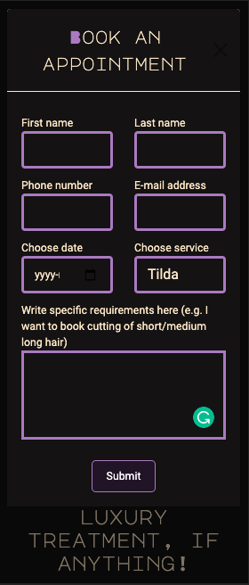
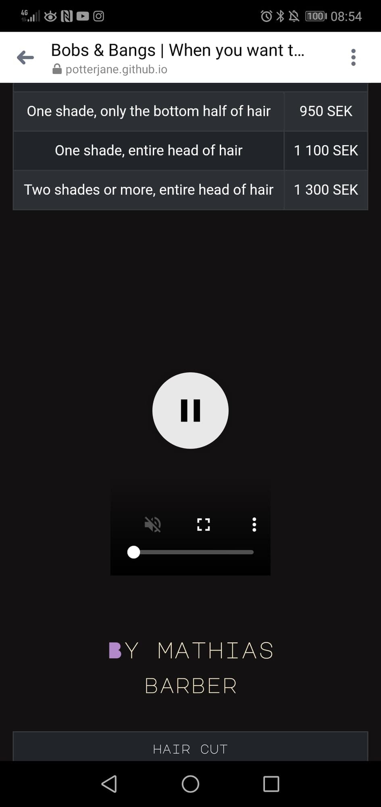

# Bobs & Bangs - Testing details

[Main README.md file](README.md)

[View website in GitHub Pages](https://potterjane.github.io/bobs-and-bangs/)

## Table of Contents

1. [**Automated Testing**](#automated-testing)
    - [**Validation services**](#validation-services)
    - [**Accessibility services**](#accessibilty-services)
    - [**Other Evaluation services via Lighthouse**](#other-evaluation-services-via-lighthouse)
2. [**User Stories Testing**](#user-stories-testing)
3. [**Manual Testing**](#manual-testing)
    - [**Testing on desktop screens**](#testing-on-desktop-screens)
    - [**Testing on tablet and phone screens**](#testing-on-tablet-and-phone-screens)
4. [**Bugs discovered**](#bugs-discovered)
    - [**Solved bugs**](#solved-bugs)
    - [**Unsolved bugs**](#unsolved-bugs)
5. [**Further Testing**](#further-testing)

## Automated Testing

### Validation services
- [W3C Markup Validation]( https://validator.w3.org/) was used to validate all the HTML pages (home, about, services, contact, booking).
Copied all the code from the html page, pasted it in the field under 'Validate by direct input' and then clicked on the 'Check' button.
**No errors or warnings to show on any of the HTML pages.**
- [W3C CSS validation](https://jigsaw.w3.org/css-validator/) was used to validate CSS. Copied all the code from the css page, pasted 
it in the field under 'By direct input' and then clicked on the 'Check' button.
**No errors were found, however there were some warnings.** 
This [StackOverflow](https://stackoverflow.com/questions/25946111/importing-css-is-ending-up-with-an-error)
post explained that the warning on line 1, 'Imported style sheets are not checked in direct input and file upload modes',
meant that it did not validate the imported style sheet. In other words, not actually a warning, just information.
The other warnings were related to 'webkit', 'moz' and 'o' property. However, this developer did not remove these properties because it helps support browser compatibility efforts. 
```
Warnings (19)
URI : TextArea
1		Imported style sheets are not checked in direct input and file upload modes
186		-webkit-background-size is an unknown vendor extension
187		-moz-background-size is an unknown vendor extension
188		-o-background-size is an unknown vendor extension
1025	::-webkit-outer-spin-button is an unknown vendor extended pseudo-element
1026	::-webkit-inner-spin-button is an unknown vendor extended pseudo-element
1027	-webkit-appearance is an unknown vendor extension
1033	-moz-appearance is an unknown vendor extension
1038	:-webkit-autofill is an unknown vendor extended pseudo-class
1039	:-webkit-autofill is an unknown vendor extended pseudo-class
1040	:-webkit-autofill is an unknown vendor extended pseudo-class
1041	:-webkit-autofill is an unknown vendor extended pseudo-class
1042	:-webkit-autofill is an unknown vendor extended pseudo-class
1043	:-webkit-autofill is an unknown vendor extended pseudo-class
1044	:-webkit-autofill is an unknown vendor extended pseudo-class
1045	:-webkit-autofill is an unknown vendor extended pseudo-class
1046	:-webkit-autofill is an unknown vendor extended pseudo-class
1048	-webkit-text-fill-color is an unknown vendor extension
1049	-webkit-box-shadow is an unknown vendor extension
```

### Accessibility services
- [Lighthouse in ChromeDev Tools](https://developers.google.com/web/tools/lighthouse#devtools) was used to
evaluate the accessibilty on all of the website's page in incognito mode, as recommended (see screenshot below).
In order to run a Lighthouse report, open Google Chrome, go to the URL for [Bobs & Bangs](https://potterjane.github.io/bobs-and-bangs/) (You can audit any URL on the web)
and then open Chrome DevTools. Change from the Elements tab to the Lighthouse tab (You might need to click on 'right arrows' icon to access this tab). Choose at least one category and a device
and then click on 'Generate report'.
**The report generated an Accessibility rate of 100 out of 100.**
- [WAVE Web Accessibility Evaluation Tool](https://wave.webaim.org/) was also used to evaluate the accessibilty
on all of the website's pages in incognito mode. You simply need to write the URL for [Bobs & Bangs](https://potterjane.github.io/bobs-and-bangs/) and then press 'Enter'
to get the results.
**The results were no errors were detected.**

<div align="center"><h4>Lighthouse error outside incognito mode</h4>

</div>

### Other Evaluation services via Lighthouse
- [Lighthouse in ChromeDev Tools](https://developers.google.com/web/tools/lighthouse#devtools) was also used
to evaluate performance, best practices and SEO on all of the website's pages in incognito mode.
**The report generated a Performance rate an average of 96 out of 100.**
**The report generated a Best Practices rate of 100 out of 100.**
**The report generated a SEO rate of 100 out of 100.**

## User Stories Testing
In this section, this developer manually tests all the user stories described on the [README](README.md)
page, under the UX section.

As a new or retained customer, I want:
1. To be able to know the background of the company, their price list of services, what other customers think of their services via reviews or social links, 
so that I can come to a decision whether or not to try out their services. 
    - Background of the company is found on the About page in 3 paragraphs with light purple colour on the company title
    to make the paragraphs more vibrant.
    - Company's price list of services is found on the Services page as tables to make it clear and concise.
    - Customer reviews are found on the Home page as a Bootstrap carousel with 4 different customer reviews.
    Scissor icons, coloured in the same light purple colour, are used as 'review stars' to make it unique and
    match the theme of the website.
    - Social links opens in a new tab on all of the pages under the footer section, making it easily accessible.

All of the above points make the website stand out and attract users to book an appointment.

2. To be able to easily book an appointment with as few clicks as possible, so that I can book an appointment with a minimum amount of time, anytime I like.
    - Modal button with booking form is found directly on the Home page, near the center.
    - A separate Booking page is found in the navigation bar (in order of importance).

When user lands on the first page, they only need to make one click to either access the booking form via the modal button or via the navigation bar.

3. To know if there are any special offers/discounts directly on the first page, so that I know straight away if I should book an appointment now or later.
    - A highlighted text that says, 'Get 15% off your first appointment!' is found on the Home page, directly under the modal button to the booking form.
    - The light-coloured highlighted text (in contrast with the rest of the page) makes it stand out and draws the user's eyes directly to it.

4. To be able to contact the company in various ways, depending on my personal preference, so that I can contact the company if I have any questions or want to book/rebook/cancel an appointment.
    - In the footer section on all of the pages, users can find the company's visiting address and click on 'target="_blank"' links to phone number, e-mail address and social applications.
    - On the Contact page, users can find information on how to rebook/cancel an appointment, can fill in a contact form and click on 'target="_blank"' links to call or e-mail the company.

5. To see several images/videos, so that I can gain a better insight on what it is like inside the hair salon/barbershop.
    - An background image of brush, scissors and razors on a wooden table is added to the hero section on the Home page. This informs the users of the hair salon's/barbershop's
    rustic aesthetic and what industry this website is related to.
    - 6 different images are added to a Bootstrap carousel to create a sense of movement but also to avoid clutter on the About page.
    - An additional 2 different images are shown on the Service page on smaller screens. On bigger screens, there are instead 2 different videos that users can control.
    When user presses play, the video is played on mute and on a loop until the user presses pause.

All of the above-mentioned images and videos are sourced from one and the same user called [cottonbro](https://www.pexels.com/@cottonbro)'s [Pexels](https://www.pexels.com/) free library.
This is done intentionally to make it feel more like a real company. This has been successful since several of the developer's friends and family that tested out the website on their devices
thought it was a real hair salon/barbershop.

As a hair stylist/barber looking for a job, I want:
1. To be able to know the background of the company, what customers think of their services via reviews or social links, so that I can come to a decision on whether or not
to send in my resume/CV.
    - Background of the company is found on the About page in 3 paragraphs with light purple colour on the company title
    to make the paragraphs more vibrant.
    - Customer reviews are found on the Home page as a Bootstrap carousel with 4 different customer reviews.
    Scissor icons, coloured in the same light purple colour, are used as 'review stars' to make it unique and
    match the theme of the website.
    - On the Contact page, the top-left section is titled 'Want to work with us?' with a direct link to the company's email-address for job seekers. 
    - Social links opens in a new tab on all of the pages under the footer section, making it easily accessible.

All of the above points make the website stand out and attract users that are potential employees to contact the company and send it their CV/resume.

2. To be able to contact the company in various ways, depending on my personal preference, so that I can contact the company if I have any more questions.
    - In the footer section on all of the pages, users can find the company's visiting address and click on 'target="_blank"' links to phone number, e-mail address and social applications.
    - On the Contact page, users can find a direct link to the company's email-address for job seekers, can fill in a contact form and click on 'target="_blank"' links to call or e-mail the company.

## Manual Testing

### Testing on desktop screens
Several tests were done on a smaller laptop screen and a bigger stationary computer screen and on the following browsers: Brave, Chrome, Edge, Firefox and Opera.
[Here](https://github.com/potterjane/bobs-and-bangs/blob/f9d6725e4f09fd3ce8d388248e187dec21b27512/wireframes/bb-website-desktop.pdf) you can find all of the screenshots of the website on a desktop screen (Macbook laptop). These screenshots were collected using [Balsamiq](https://balsamiq.com/). You can compare the desktop screenshots 
with the [second and final version](https://github.com/potterjane/bobs-and-bangs/blob/f1370748e2ef25d35dbc62a0b01a8b6aca7fa1b8/wireframes/bb-wireframes-version-2.pdf) of the wireframes.

This developer followed these steps:

1. Booking form on Booking page
    * Go to the Booking page
    * Submit the form without filling any of the fields and verify that an error message about the required fields appears
    * Submit the form with letters or symbols in the 'Phone number' field and verify that an error message about invalid phone number appears
    * Submit the form with just letters and no '@' symbol or with letters before but not after the '@' symbol in the 'E-mail address' field and verify that an error message about invalid e-mail address appears
    * Submit the form without choosing a date in the 'Choose date' field and verify that an error message about the required fields appears
    * Submit the form without choosing a service in the 'Choose service' field and verify that an error message about the required fields appears
    * Submit the form with all fields filled in with valid inputs and verify that the form 'clears empty' when clicking the 'Submit' button. This action is expected and correct in this project.
    * Submit the form with all fields, except the 'Specific requirements', field filled in with valid inputs and verify that the form 'clears empty' when clicking the 'Submit' button. This action is also expected and correct in this project.

2. Booking form on Home page
    * Go to the Home page
    * Click on the 'Book Now' modal button
    * Check that the form appears in the center of the page and the rest of the Home page becomes a backdrop
    * Check that you can click anywhere on the backdrop to exit the form
    * Submit the form without filling any of the fields and verify that an error message about the required fields appears
    * Submit the form with letters or symbols in the 'Phone number' field and verify that an error message about invalid phone number appears
    * Submit the form with just letters and no '@' symbol or with letters before but not after the '@' symbol in the 'E-mail address' field and verify that an error message about invalid e-mail address appears
    * Submit the form without choosing a date in the 'Choose date' field and verify that an error message about the required fields appears
    * Submit the form without choosing a service in the 'Choose service' field and verify that an error message about the required fields appears
    * Submit the form with all fields filled in with valid inputs and verify that the form 'clears empty' when clicking the 'Submit' button. This action is expected and correct in this project.
    * Submit the form with all fields, except the 'Specific requirements', field filled in with valid inputs and verify that the form 'clears empty' when clicking the 'Submit' button. This action is also expected and correct in this project.

3. Review carousel on Home page
    * Go to the Home page and scroll down to the review carousel
    * Check that the reviews are cycling through automatically
    * Check that when you hold down the mouse button over a review, it stops cycling through
    * Check that when you click on an indicator below the carousel, it takes you to the corresponding review
    * Check that when you move your mouse away from the reviews, they are cycling through again automatically

4. Image carousel on About page
    * Go to the About page
    * Check that the images are cycling through automatically
    * Check that when you hold down the mouse button over an image, it stops cycling through
    * Check that when you move your mouse away from the images, they are cycling through again automatically

5. Contact form on Contact page
    * Go to the Contact page
    * Submit the form without filling any of the fields and verify that an error message about the required fields appears
    * Submit the form with all fields, except the 'Message' field, filled in and verify that an error message about the required fields appears
    * Submit the form with just letters and no '@' symbol or with letters before but not after the '@' symbol in the 'E-mail address' field and verify that an error message about invalid e-mail address appears
    * Submit the form with all fields filled in with valid inputs and verify that the form 'clears empty' when clicking the 'Send' button. This action is expected and correct in this project.

6. Links on Contact page
    * Go to the Contact page
    * Check that all the links either opens an external application or opens a new tab

7. Links on footer section
    * Go to any page and scroll down to the footer section
    * Check that all the links either opens an external application or opens a new tab

8. Embedded Google Maps
    * Go to the Contact page
    * Check that the embedded Google Maps is displayed and shows the correct address
    * Check that you can zoom in and out of the Maps
    * Check that you can click on 'View larger map' to open Google Maps in a new tab

9. Videos on Services page
    * Go to the Services page
    * Check that the videos are displayed and there are no broken links
    * Check that the controls are working by pressing the play/pause button, volume, fullscreen toggle, etc
    * Check that when you press play, the videos remain muted and is on a loop until you press pause
    * Check that you cannot unmute the videos

10. Navigation
    * Go to any page
    * On the top-left of the page, check that you see the company logo, 'B&B' with the first 'B' and '&' colored in 'blanchealmond' and
    the second 'B' colored in light purple
    * Check that when you hover over the company logo, the entire logo turns to the same light purple color
    * Check that when you click on the company logo, you stay or end up on the Home page
    * On the top-right of the page, check that you see all 5 navigation links to 'Home', 'About', 'Services', 'Contact' and 'Booking',
    all colored in 'blanchealmond' and all horizontally-aligned.
    * Check that when you hover over one of the navigation links, it turns to the light purple color.
    * Check that when you click on one of the navigation links, it takes you to the corresponding page.

### Testing on mobile screens
Several tests were done on a Huawei mobile screen and an iPhone 6 mobile screen and on the following browsers: Chrome, Safari and via Facebook Messenger.
You can find all of the screenshots of the website on Chrome DevTools' tablet (iPad) [here](https://github.com/potterjane/bobs-and-bangs/blob/ae58108bda48509f1f9123347b45449c4a192631/wireframes/bb-website-tablet.pdf) 
and for mobile screen (iPhone X) [here](https://github.com/potterjane/bobs-and-bangs/blob/ae58108bda48509f1f9123347b45449c4a192631/wireframes/bb-website-mobile.pdf). You can compare the mobile screenshots 
with the [second and final version](https://github.com/potterjane/bobs-and-bangs/blob/f1370748e2ef25d35dbc62a0b01a8b6aca7fa1b8/wireframes/bb-wireframes-version-2.pdf) of the wireframes.

This developer followed these steps:

1. Booking form on Booking page
    * Go to the Booking page
    * Submit the form without filling any of the fields and verify that an error message about the required fields appears
    * Submit the form with letters or symbols in the 'Phone number' field and verify that an error message about invalid phone number appears
    * Submit the form with just letters and no '@' symbol or with letters before but not after the '@' symbol in the 'E-mail address' field and verify that an error message about invalid e-mail address appears
    * Submit the form without choosing a date in the 'Choose date' field and verify that an error message about the required fields appears
    * Submit the form without choosing a service in the 'Choose service' field and verify that an error message about the required fields appears
    * Submit the form with all fields filled in with valid inputs and verify that the form 'clears empty' when clicking the 'Submit' button. This action is expected and correct in this project.
    * Submit the form with all fields, except the 'Specific requirements', field filled in with valid inputs and verify that the form 'clears empty' when clicking the 'Submit' button. This action is also expected and correct in this project.

2. Booking form on Home page
    * Go to the Home page
    * Click on the 'Book Now' modal button
    * Check that the form appears in the center of the page and the rest of the Home page becomes a backdrop
    * Check that you can click anywhere on the backdrop to exit the form
    * Submit the form without filling any of the fields and verify that an error message about the required fields appears
    * Submit the form with letters or symbols in the 'Phone number' field and verify that an error message about invalid phone number appears
    * Submit the form with just letters and no '@' symbol or with letters before but not after the '@' symbol in the 'E-mail address' field and verify that an error message about invalid e-mail address appears
    * Submit the form without choosing a date in the 'Choose date' field and verify that an error message about the required fields appears
    * Submit the form without choosing a service in the 'Choose service' field and verify that an error message about the required fields appears
    * Submit the form with all fields filled in with valid inputs and verify that the form 'clears empty' when clicking the 'Submit' button. This action is expected and correct in this project.
    * Submit the form with all fields, except the 'Specific requirements', field filled in with valid inputs and verify that the form 'clears empty' when clicking the 'Submit' button. This action is also expected and correct in this project.

3. Review carousel on Home page
    * Go to the Home page and scroll down to the review carousel
    * Check that the reviews are cycling through automatically
    * Check that when you hold down the mouse button over a review, it stops cycling through
    * Check that when you click on an indicator below the carousel, it takes you to the corresponding review
    * Check that when you move your mouse away from the reviews, they are cycling through again automatically

4. Image carousel on About page
    * Go to the About page
    * Check that the images are cycling through automatically
    * Check that when you hold down the mouse button over an image, it stops cycling through
    * Check that when you move your mouse away from the images, they are cycling through again automatically

5. Contact form on Contact page
    * Go to the Contact page
    * Submit the form without filling any of the fields and verify that an error message about the required fields appears
    * Submit the form with all fields, except the 'Message' field, filled in and verify that an error message about the required fields appears
    * Submit the form with just letters and no '@' symbol or with letters before but not after the '@' symbol in the 'E-mail address' field and verify that an error message about invalid e-mail address appears
    * Submit the form with all fields filled in with valid inputs and verify that the form 'clears empty' when clicking the 'Send' button. This action is expected and correct in this project.

6. Links on Contact page
    * Go to the Contact page
    * Check that all the links either opens an external application or opens a new tab

7. Links on footer section
    * Go to any page and scroll down to the footer section
    * Check that all the links either opens an external application or opens a new tab

8. Embedded Google Maps
    * Go to the Contact page
    * Check that the embedded Google Maps is displayed and shows the correct address
    * Check that you can zoom in and out of the Maps
    * Check that you can click on 'View larger map' to open Google Maps in a new tab

9. Images on Services page
    * Go to the Services page
    * Check that the images are displayed and there are no broken links

10. Navigation
    * Go to any page
    * On the top-left of the page, check that you see the company logo, 'B&B' with the first 'B' and '&' colored in 'blanchealmond' and
    the second 'B' colored in light purple
    * Check that when you click on the company logo, the entire logo turns to the same light purple color and you either
    stay or end up on the Home page
    * On the top-right of the page, check that you see a navbar or a 'hamburger' 
    * Check that when you click on the navbar/'hamburger', it uncollapses and shows all 5 navigation links to 'Home', 'About', 'Services', 'Contact' and 'Booking',
    all colored in 'blanchealmond', all vertically-aligned
    * Check that when you click on the navbar/'hamburger' again, it collapses and hides all 5 navigation links
    * Check that when you click on one of the navigation links, it turns to the light purple color and it takes you to the corresponding page.

## Bugs discovered

### Solved bugs
1. **Jumping behaviour on the uncollapsed navbar**

    When collapsing and uncollapsing the navbar for mobile and tablet screens, the entire ul presented a 'jump' behaviour.

    **How this developer fixed it:**

    With the help of the [SimplySmartMedia](https://simplysmartmedia.com/2016/06/heres-why-your-bootstrap-collapsed-alert-jumps-when-expanded/)'s post, 
    the ```class="nav-container-collapse"``` was moved from the ```<ul>``` element to the grandparent ```<div>``` element.

    ```html
        <div class="collapse nav-container-collapse" id="navbarToggleExternalContent">
            <div class="p-4">
                <nav>
                    <ul>
                        <li class="row"> 
                            <a class="col-12" href="index.html"><p>home</p></a>
                        </li>
                        <li class="row"> 
                            <a class="col-12" href="about.html"><p>about</p></a>
                        </li>
                        <li class="row"> 
                            <a class="col-12" href="services.html"><p>services</p></a>
                        </li>
                        <li class="row"> 
                            <a class="col-12" href="contact.html"><p>contact</p></a>
                        </li>
                        <li class="row"> 
                            <a class="col-12" href="booking.html"><p>booking</p></a>
                        </li>
                    </ul>
                </nav>
            </div>
        </div>
    ```

2. **Jumping behaviour of the customer review carousel**

    On the Home page, carousel slide number 2 had an extra paragraph line in comparison to the other slides, 
    which caused the whole carousel to present a 'height jump' behaviour when slide 2 was presented in desktop screens.

    Adjusting the number of paragraph lines to be equal for each slide did not solve the 'height jump' issue for smaller screens.

    **How this developer fixed it:**

    In order for the carousel to be fully responsive and not present a 'height jump' behaviour on any screen sizes,
    ```min-height``` and ```max-height``` was set to the ```#carouselExampleIndicators``` and ```font-size```
    was adjusted for each ```.carousel-item``` under ```@media screen```.

    For example:

    ```css
        @media screen and (max-width: 576px) {

            #carouselExampleIndicators {
                min-height: 18rem;
                max-height: 18rem;
            }

            .carousel-item {
                font-size: 0.95rem;
            }

        }
    ```

    This developer was able to do this with inspiration from this [StackOverflow](https://stackoverflow.com/questions/29985360/bootstrap-carousel-whole-website-jumps-when-image-is-changing) post.

3. **Jumping behaviour of the image carousel**

    Just like the customer review carousel on the Home page, the image carousel presented a jumping behaviour when
    switching slides. This is because the images are not of equal height.
    
    **How this developer fixed it:**

    Similarly to the previous bug fix, in order for the carousel to be fully responsive and not present a 'height jump' 
    behaviour on any screen sizes, ```min-height``` and ```max-height``` was set to the ```.carousel-inner``` for the 
    ```@media screen``` that presented this bug.

    For example:

    ```css
        @media screen and (max-width: 320px) {

            .carousel-inner {
                min-height: 18rem;
                max-height: 18rem;
            }

        }
    ```

4. **Incorrecly aligned navbar links on tablet and mobile screens**

    When collapsing and uncollapsing the navbar for mobile and tablet screens, the navigation links were aligned horizontally instead of vertically.

    **How this developer fixed it:**

    Added Bootstraps's ```class="row"``` to the ```li``` element and Bootstrap's ```class="col-12"``` to the child ```a``` element.

    ```html
        <div class="collapse nav-container-collapse" id="navbarToggleExternalContent">
            <div class="p-4">
                <nav>
                    <ul>
                        <li class="row"> 
                            <a class="col-12" href="index.html"><p>home</p></a>
                        </li>
                        <li class="row"> 
                            <a class="col-12" href="about.html"><p>about</p></a>
                        </li>
                        <li class="row"> 
                            <a class="col-12" href="services.html"><p>services</p></a>
                        </li>
                        <li class="row"> 
                            <a class="col-12" href="contact.html"><p>contact</p></a>
                        </li>
                        <li class="row"> 
                            <a class="col-12" href="booking.html"><p>booking</p></a>
                        </li>
                    </ul>
                </nav>
            </div>
        </div>
    ```

5. **Visible spinners/arrows on the Phone number field**

    The spinners/arrows in the 'Phone number' field in the booking forms were visible. 

    **How this developer fixed it:**
    
    With the help from this [W3Schools](https://www.w3schools.com/howto/howto_css_hide_arrow_number.asp) post, the spinners/arrows were removed by adding the following code:

```css
    /* Removed the up and down spinner from the 'number' input field, code taken from W3Schools */
    /* Chrome, Safari, Edge, Opera */
    input::-webkit-outer-spin-button,
    input::-webkit-inner-spin-button {
        -webkit-appearance: none;
        margin: 0;
    }

    /* Firefox */
    input[type=number] {
        -moz-appearance: textfield;
    }
    /* /Removed the up and down spinner from the 'number' input field, code taken from W3Schools */
```

### Unsolved bugs

1. **Adjust the font size of all the 'Choose service' options**

    Regarding the ```<form>``` for the Booking page and for the modal in the Home page, this developer has not found 
    a solution to adjust the font size of all the 'Choose service' options for smaller screens.

<div align="center"><h4>Incorrect 'Choose service' font size</h4>

</div>

2. **Position of the uncollapsed navbar differs between screen sizes**

    Between ```@media screen and max-width``` of 668px - 1199px, the uncollapsed navbar floats near the center of the 
    page instead of the right-hand side of the page right under the navbar icon. This developer has not found a solution 
    for this.

<div align="center"><h4>Incorrect position of the uncollapsed navbar</h4>

</div>

3. **Videos not playing on mobile devices**

    For some reason, the videos are not playing on any mobile devices. The video remains black when you press play. 

<div align="center"><h4>Video not playing on mobile</h4>

</div>


Tried to solve this issue by adding ```type``` attribute in the ```video``` element.
However, the W3C validator came back with an error stating that the ```type``` attribute is not accepted in the ```video``` element. With the help of this 
[Stackoverflow](https://stackoverflow.com/questions/22365474/attribute-type-not-allowed-on-element-video-at-this-point-how-to-fix-this-error) post, 
it was suggested to use the ```source``` element as child of the ```video``` element instead. However, this still did not solve the issue.

Converted videos from .mp4 to .ogg, .ogv, .webm and .flv and added the videos and its corresponding ```type``` attribute in the ```video``` element, in the order according to this
[StackOverflow](https://stackoverflow.com/questions/13360830/html5-video-only-works-in-ie-the-other-browsers-shows-the-black-screen) post. This did not solve the issue.

Got in touch with Code Institute tutor, Igor. He told the developer to add ```playsinline``` attribute to the ```video``` element, as suggested in this 
[StackOverflow](https://stackoverflow.com/questions/38893692/html-video-not-working-on-mobile) post. This did not solve the issue. 
Igor then suggested to validate all of the code on the services.html via the W3C validator and then try again. This did not solve the issue either.

```html
    <div class="col-4 tilda-video">
        <video playsinline controls muted loop>
            <source src="assets/videos/tilda-video.mp4" type="video/mp4">
            <source src="assets/videos/tilda-video.ogv" type="video/ogg">
            <source src="assets/videos/tilda-video.webm" type="video/webm">
            <source src="assets/videos/tilda-video.flv" type="video/x-flv">
            Your browser does not support embedded videos.
        </video>
    </div>
```

Since the issue was not solved, this developer replaced the videos with images, just for mobile screens or smaller tablet screens.

4. **Disable certain dates in the datepicker**

    In the booking form, there is a datepicker where user is required to choose a date when booking an appointment.
    This developer wanted to be able to disable past dates but also dates that fall on Sundays to match the company's opening hours. 
    However, according to this [StackOverflow](https://stackoverflow.com/questions/17182544/disable-certain-dates-from-html5-datepicker) post, this cannot be done with JavaScript.

## Further testing

- Used Chrome DevTools repeatedly throughout the project to test the website on all the different
devices and orientations available in the built-in tool.
- Tested out the website on different computer/laptop screen sizes and also on developer's iPhone 6.
- Asked friends and family to test out the website on their devices to see if there were any 
further issues found.